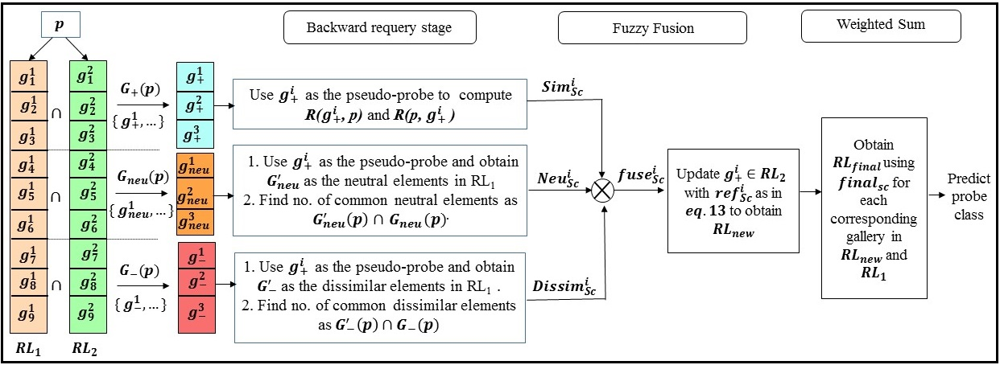

# dualranking_TIFS_2018  
This is the code for our paper [Dictionary Alignment with Re-ranking for Low Resolution NIR-VIS Face Recognition.](https://ieeexplore.ieee.org/document/8452967) published in IEEE Transactions on Information Forensics and Security, 2018.  

### Getting the Data  
Download the scores and the features of the test set to compute the final ranklist to evaluate the accuracy from  
[Google Drive](https://drive.google.com/drive/folders/15iq2-DKMNthYAXreHoaNjBD6lROT2OuM?usp=sharing).  
Save the Scores (.mat files) under the ```"Scores/"``` folder and the features of the test data (.mat files) under the ```"Test_Data/"``` folder.  

### Data Description  
The Score and Test features provided has been evaluated on the modified CASIA NIR-VIS 2.0 dataset (Li *et al.*, CVPRW, 2013). The modified version signifies that all NIR images have been downsampled to resolution of 20 x 20 and then upsampled to 128 x 128 such that the resultant image are low-resolution.  
  
  
We use pre-trained model of VGG-Face (Parkhi *et al.*, BMVC 2015) to extract features where we concatenate Pool5, fc6 and fc7 features and then apply PCA to get a reduced feature dimension of 2500 X N, where N is the number of samples in each fold. We do this process for both Low-resolution NIR and High-resolution VIS images for all 10 folds according to the dataset protocol.

### Algorithm Description & Architecture
Our contribution is a novel re-ranking algorithm, which takes the ranks (scores) given by the [Dictionary Alignment approach](https://ieeexplore.ieee.org/document/7926712) and any other approach to further improve the recognition performance. We design our re-ranking approach by analyzing strongly similar, dissimilar and the neutral gallery images given by the two techniques.  
  
Here, we use Dictionary Alignment along with Compact Binary Face Descriptors(CBFD) (Lu *et al.*, TPAMI, 2015) and compute the optimized ranklist using our proposed Re-ranking algorithm.  
  
RL1 and RL2 are the ranklist obtained from Dictionary Alignment approach and CBFD respectively. In place of RL1 and RL2 you may use ranklist obtained from the approach of your choice.
  
  
  

### Usage
After extracting the features, scores and Test data run the ```dual_reranking.m``` file.  
  
### Dataset used  
1. [CASIA NIR-VIS 2.0 dataset](https://pythonhosted.org/bob.db.cbsr_nir_vis_2/)  
2. [SCface dataset](http://www.scface.org/)  
3. HPR dataset (to be released shortly)  

You need to prepare the dataset on your own i.e. prepare the images and its corresponding labels for training and testing for all folds of the protocol described by the dataset. Since SCface dataset has no specific evaluation protocol, we have defined our protocol which can be found in our paper.  
  
### Citation  
If you use the code in this repository in your paper, please consider citing:  
```
@Article{Mudunuri_TIFS,   
 author = {Sivaram Prasad Mudunuri, and Shashanka Venkataramanan, and Soma Biswas},    
  title = {Dictionary Alignment with Re-ranking for Low Resolution NIR-VIS Face Recognition.},    
  journal = {IEEE Transactions on Information Forensics and Security},  
  volume="14",    
  number="4",      
  pages="886 -- 896",    
  month = {April},   
  year = {2019} 
}
```  
  
### Queries
Please feel free to contact [Me](https://shashankvkt.github.io/) for the re-ranking algorithm & [Sivaram](https://sites.google.com/site/sivaramprasad443/) for any queries related to Dicionary Alignment approach.  
Corresponding Author: [Dr. Soma Biswas](http://www.ee.iisc.ac.in/new/people/faculty/soma.biswas/index.html)
